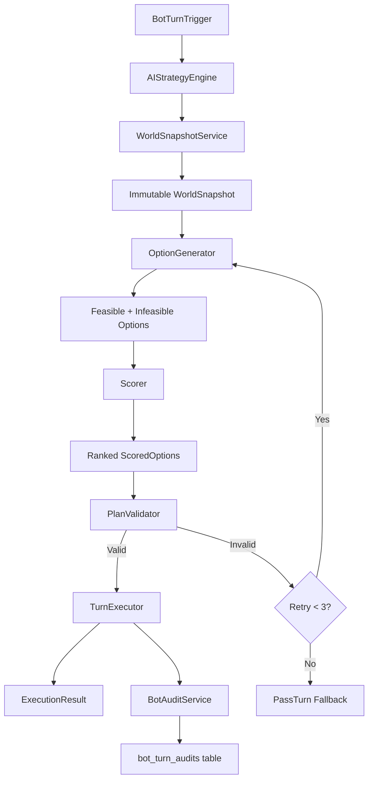

# AI Pipeline Architecture

## Overview

The AI bot pipeline processes each bot turn through a sequence of stages: snapshot capture, option generation, scoring, validation, and execution. The orchestrator (`AIStrategyEngine`) coordinates these stages with retry logic and a PassTurn fallback.

## Pipeline Data Flow

## Components

### BotTurnTrigger
Entry point that detects when it is a bot's turn and initiates the AI pipeline. Integrates with the existing turn advancement system.

### AIStrategyEngine
Top-level orchestrator. Runs the full pipeline with up to 3 retries. If all retries fail, falls back to PassTurn. Also handles bot auto-placement (places train at best major city when bot has track but no position).

### WorldSnapshotService
Captures an immutable snapshot of the complete game state visible to the bot:
- Bot position, money, debt, train type, movement allowance
- Carried loads and demand cards
- Track network and connected major cities
- Opponent data (position, money, train type, loads, track count)
- Load availability and dropped loads per city
- Map grid points

### OptionGenerator
Generates all feasible actions the bot could take. Methods are `private static` and return `FeasibleOption[]` arrays. Uses `makeFeasible()` / `makeInfeasible()` helpers. Options include:
- **DeliverLoad** - Deliver a carried load to a demanding city
- **PickupAndDeliver** - Pick up a load and deliver it
- **BuildTrack** - Build track segments toward destinations
- **UpgradeTrain** - Upgrade to a faster/larger train
- **BuildTowardMajorCity** - Expand network toward a major city
- **PassTurn** - Do nothing (always feasible)

### Scorer
Evaluates each feasible option across 12 scoring dimensions, weighted by the bot's archetype and skill profile. Produces `ScoredOption[]` ranked by total score.

**Scoring Dimensions:**
`immediateIncome`, `incomePerMilepost`, `multiDeliveryPotential`, `networkExpansionValue`, `victoryProgress`, `competitorBlocking`, `riskExposure`, `loadScarcity`, `upgradeROI`, `backboneAlignment`, `loadCombinationScore`, `majorCityProximity`

### PlanValidator
Validates the top-scored plan before execution using standalone functions with `SimulatedState` for cumulative validation. Requires `segments` for BuildTrack and BuildTowardMajorCity actions.

### TurnExecutor
Executes the validated plan within the caller's database transaction. Handlers are `private static async` methods. On failure, the transaction rolls back.

### BotAuditService
Persists a `StrategyAudit` record after each bot turn for transparency and debugging via the Strategy Inspector UI.

## Skill Levels

| Setting | Easy | Medium | Hard |
|---------|------|--------|------|
| Random choice % | 20% | 5% | 0% |
| Suboptimality % | 30% | 10% | 0% |
| Lookahead depth | 0 turns | 2 turns | 4 turns |
| Lookahead breadth | 1 | 3 | 3 |

## Archetypes

| Archetype | Focus | Key Multipliers |
|-----------|-------|-----------------|
| **Backbone Builder** | Strong interconnected network | networkExpansion 1.5x, backbone 2.0x |
| **Freight Optimizer** | Maximize income per move | incomePerMilepost 2.0x, immediateIncome 1.5x |
| **Trunk Sprinter** | Fast routes + early upgrades | upgradeROI 2.0x, incomePerMilepost 1.5x |
| **Continental Connector** | Race to connect 7 major cities | victoryProgress 2.0x, majorCityProximity 2.0x |
| **Opportunist** | Exploit scarce resources + block competitors | competitorBlocking 1.5x, loadScarcity 1.5x |

## Key Design Patterns

1. **Immutable Snapshots** - `WorldSnapshot` is captured once per turn and never mutated, ensuring deterministic decision-making.
2. **Feasibility-First Generation** - Options are checked for feasibility during generation, separating "can I do this?" from "should I do this?"
3. **Retry + Fallback** - Up to 3 retries with PassTurn as the guaranteed-safe fallback ensures bots never stall the game.
4. **Transactional Execution** - All state mutations happen within a single DB transaction for atomicity.
