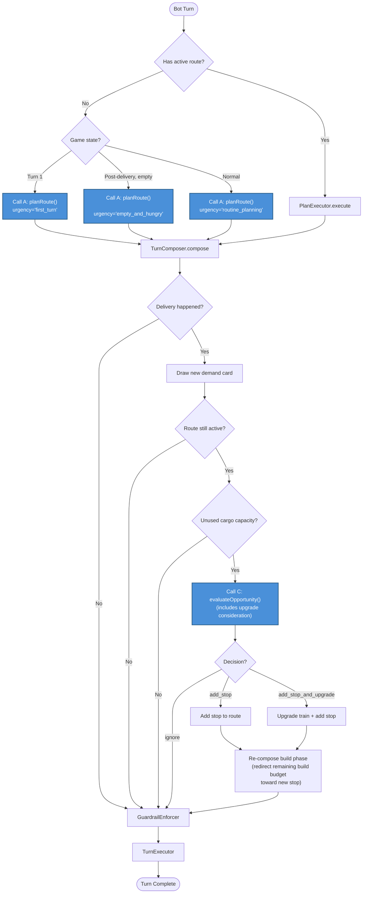

# JIRA-86: Restructure LLM Calls to Mirror Human Strategic Thinking

## Problem

The current LLM call architecture has two modes:
1. **`planRoute()`** — heavyweight strategic planning when no active route exists
2. **`reEvaluateRoute()`** — lightweight continue/amend/abandon after delivery

This doesn't match how a human player actually thinks. A human has 5 distinct decision types with different risk tolerances, information needs, and mental framing. Our bot uses the same prompt regardless of situational urgency, never considers opportunistic multi-load planning via LLM, and handles train upgrades entirely with heuristics.

## Human Decision Model

| # | Decision Type | Mental State | Risk Tolerance | Current Coverage |
|---|---|---|---|---|
| 1 | Initial delivery / starting city | Planning, optimistic | Moderate | `planRoute()` — adequate |
| 2 | Post-delivery, nothing planned | Hungry, urgent | High — will take suboptimal loads | `reEvaluateRoute()` — wrong framing (same prompt as calm re-eval) |
| 3 | Have 1 load, drew new demand card | Opportunistic | Moderate — only if convenient | TurnComposer A1 heuristic only — LLM never consulted |
| 4 | Have 2 loads, drew new card — 3rd load? | Ambitious | Low — only if very profitable + may upgrade | Not covered at all |
| 5 | Lots of track, want speed | Investment-minded | Depends on cash | Heuristic threshold only |

## Proposed Architecture

### Call A: `planRoute()` — "What do I do?" (Types 1 & 2)

**Change**: Add situational framing via an `urgency` context field.

- `"first_turn"` — Emphasize starting city selection, network-building potential, early game priorities
- `"empty_and_hungry"` — "You have no active deliveries. Prioritize getting ANY profitable load moving, even suboptimal. Consider loads already near your train position. Speed of first pickup matters more than optimal payout."
- `"routine_planning"` — Current behavior, balanced optimization

**Implementation**: Modify `ContextBuilder.serializeRoutePlanningPrompt()` to accept and inject urgency framing. Modify `getRoutePlanningPrompt()` system prompt to vary tone based on urgency.

### Call B: `planRoute()` with `"empty_and_hungry"` urgency — "I need something NOW" (Type 2)

**This is NOT a separate call** — it's Call A with the `"empty_and_hungry"` urgency. After delivering a load and having nothing planned, the bot re-enters `planRoute()` with heightened urgency framing. There is no separate "should I change plans?" call because there are no plans to change — the bot just completed its route.

**When triggered**: Post-delivery, no active route remains, train is empty or has unplanned cargo.

### Call C: `evaluateOpportunity()` — NEW — "Can I do more?" (Types 3 & 4)

**Trigger conditions**:
- A new demand card was drawn (after delivery or discard)
- Bot has unused cargo capacity (fewer loads than train allows)
- Bot has an active route (otherwise falls to planRoute)

**Prompt framing**:
- "You just drew [new demand card]. You're heading to [destination] carrying [current loads]. Your train can carry [capacity] loads. Is there a profitable second/third pickup along your route or near your destination?"
- For type 4 (at capacity but sees opportunity): "Would picking up a third load justify upgrading to Heavy Freight for 20M ECU?"

**Output schema**:
```typescript
interface OpportunityEvaluation {
  action: "ignore" | "add_stop" | "add_stop_and_upgrade";
  reasoning: string;
  newStop?: { city: string; loadType: string; pickupOrDelivery: "pickup" | "delivery" };
  upgradeTarget?: "heavy_freight" | "superfreight";
}
```

**Config**: Lightweight like reEvaluateRoute — no thinking, temperature=0, short timeout. This should be a quick "yes/no/maybe" decision.

### Call D: `evaluateUpgrade()` — "Should I invest in my train?" (Type 5)

**Option A — Standalone call**:
- Trigger: cash > 40M, hasn't upgraded recently, significant track network
- Prompt: "You have [X] ECU and a [train type]. Given your delivery distances and network size, would upgrading to [next train] for 20M be worth the investment? Consider: speed (9→12 mileposts) saves ~1 turn per 12-milepost trip. Capacity (2→3 loads) lets you combine deliveries."

**Option B — Fold into Call C**:
- When evaluateOpportunity fires, include upgrade context in the prompt
- "You could also upgrade your train for 20M. Would that unlock better multi-load strategies?"

**Recommendation**: Start with Option B (fold into Call C) to minimize additional LLM calls. Extract to standalone only if the combined prompt gets too complex.

## Call Flow (Revised)



## Implementation Plan

### Phase 1: Urgency-Aware planRoute (Type 1 & 2)
- Add `urgency` field to `RoutePlanningContext`
- Modify `ContextBuilder.serializeRoutePlanningPrompt()` to inject urgency framing
- Modify `getRoutePlanningPrompt()` to vary system prompt tone
- Set urgency in `AIStrategyEngine.takeTurn()` based on game state (turn number, empty train, etc.)
- **Low risk** — modifies existing call, doesn't add new ones

### Phase 2: evaluateOpportunity (Types 3 & 4)
- New method `LLMStrategyBrain.evaluateOpportunity()`
- New schema `OPPORTUNITY_SCHEMA`
- New system prompt `getOpportunityPrompt()`
- Wire into `AIStrategyEngine.takeTurn()` post-delivery when capacity available
- Include upgrade consideration in prompt
- **Build phase re-composition**: When Call C returns `add_stop` or `add_stop_and_upgrade`, re-run only TurnComposer's build phase with the amended route. The original build target may no longer be relevant — the new stop might need track built in a different direction. This is a partial re-compose (build phase only), not a full TurnComposer re-run. Movement and pickup phases are already locked in.
- **Medium risk** — new LLM call site, new decision path, build phase re-entry

### Phase 3: Upgrade reasoning (Type 5)
- If Phase 2 doesn't adequately cover upgrade decisions, extract to standalone `evaluateUpgrade()` call
- Triggered periodically (every N turns) or when cash crosses thresholds
- **Low risk** — additive only

## LLM Cost Impact

- **Call A**: Same frequency, slightly longer prompt (urgency framing adds ~50 tokens)
- **Call C**: New call, but lightweight config (no thinking, low tokens). Fires only on delivery + remaining route + available capacity — less frequent than current reEvaluateRoute
- **Removed**: Old `reEvaluateRoute()` call eliminated — its "continue" case is now implicit (route still active → keep going), its "abandon" case is handled by route completion, and "amend" is replaced by Call C's `add_stop`
- **Net impact**: Roughly neutral. Call C replaces reEvaluateRoute in most scenarios. Estimated +$0.001-0.003 per delivery at Haiku pricing.

## Success Metrics

- Bot makes fewer "wrong direction" moves after delivery (currently confusing to observers)
- Bot utilizes multi-load capacity more often (currently Heavy Freight bots often carry 1 load)
- Bot upgrade timing correlates with network size / delivery patterns rather than arbitrary cash thresholds
- Reduced PassTurn rate in post-delivery situations

## Files to Modify

- `src/server/services/ai/LLMStrategyBrain.ts` — new method, modified planRoute urgency
- `src/server/services/ai/AIStrategyEngine.ts` — new call site in takeTurn pipeline
- `src/server/services/ai/ContextBuilder.ts` — urgency framing in prompt serialization
- `src/server/services/ai/prompts.ts` — new system prompts, modified planRoute prompt
- `src/server/services/ai/schemas.ts` — new OPPORTUNITY_SCHEMA
- `src/server/services/ai/TurnComposer.ts` — expose build-phase-only re-composition for post-opportunity route amendments
- `src/server/services/ai/providers/AnthropicAdapter.ts` — no changes expected
- `src/server/services/ai/providers/GoogleAdapter.ts` — no changes expected
