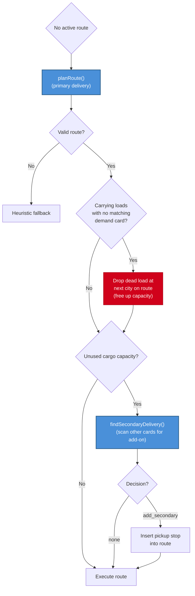

# JIRA-89: Proactive Secondary Delivery Planning

## Problem

After `planRoute()` plans a single delivery, the bot immediately executes without considering whether a second load could be picked up along the way. A human player always does this — they plan their primary delivery, then scan their other demand cards for a profitable second load that shares part of the route.

Currently, the bot only considers multi-load opportunities reactively (after a delivery via JIRA-86 re-eval). But the optimal play is to plan both loads upfront before the first movement, combining pickups and deliveries to save turns.

### Example: Game c22ab70c

Flash planned `Cattle@Bern → deliver@Ruhr`. It also had `Sheep@Bilbao → deliver@Ruhr` ranked #2. Both deliver to the same city. The human-optimal play:

1. Pick up Cattle at Bern
2. Travel to Bilbao, pick up Sheep
3. Deliver both at Ruhr (one trip, two payoffs)

Instead, Flash delivered Cattle alone, then had to plan a separate trip for Sheep — wasting several turns.

## Human Mental Model

A human player, after deciding on their primary delivery:
1. Looks at their other 2 demand cards
2. Checks if any second load is available near the planned route
3. Checks if the delivery city is along the route or the same destination
4. If profitable, plans the double pickup before moving

This is not reactive — it happens immediately during route planning.

## Proposed Solution

### New LLM Call: `findSecondaryDelivery()`

**When**: Immediately after `planRoute()` returns a valid route, before execution begins.

**Trigger conditions**:
- `planRoute()` returned a valid route
- Bot has unused cargo capacity (Freight/Fast Freight can carry 2, Heavy/Super can carry 3)
- Bot has other demand cards beyond the one being fulfilled by the primary route

**Prompt framing**:
```
You just planned a route: [primary route description].
Your train can carry [capacity] loads. You are currently carrying [N] loads.

Your other demand cards:
- [card 2 details: load, supply city, delivery city, payout]
- [card 3 details: load, supply city, delivery city, payout]

Available loads near your route: [loads within N hops of route waypoints]

Is there a profitable secondary pickup you can add to this trip?
Consider:
- Loads where the supply city is ON or NEAR your existing route
- Loads where the delivery city is ON or NEAR your existing route (or the same city)
- The detour cost (extra turns) vs the payout
- Same-destination deliveries are especially valuable (deliver 2 loads in one stop)
```

**Output schema**:
```typescript
interface SecondaryDeliveryEvaluation {
  action: "none" | "add_secondary";
  reasoning: string;
  secondaryStop?: {
    pickupCity: string;
    loadType: string;
    deliveryCity: string;
    payout: number;
  };
}
```

**Config**: Lightweight — no thinking, temperature=0, low maxTokens (1024), short timeout (8s). This is a quick yes/no decision with optional stop details.

### Route Amendment

When `findSecondaryDelivery()` returns `"add_secondary"`:
1. Insert the pickup stop into the route at the optimal position (minimize detour)
2. If the delivery city differs from the primary destination, append a delivery stop
3. If the delivery city is the same as the primary destination, the existing delivery stop handles both loads
4. Update `planHorizon` to reflect the multi-stop route

**Example amendment**:
```
Before: pickup(Cattle@Bern) → deliver(Cattle@Ruhr)
After:  pickup(Cattle@Bern) → pickup(Sheep@Bilbao) → deliver(Cattle+Sheep@Ruhr)
```

## Call Flow



## Dead Load Detection

Before checking cargo capacity, scan the train for **dead loads** — loads the bot is carrying that have no matching demand card.

A load is "dead" when:
- The bot has no demand card requesting that load type at any city

### Detection Logic (no LLM needed — pure heuristic)

```typescript
function findDeadLoads(carriedLoads: Load[], demandCards: DemandCard[]): Load[] {
  return carriedLoads.filter(load => {
    // A load is alive if ANY demand card wants this load type
    const hasMatchingDemand = demandCards.some(card =>
      card.demands.some(d => d.loadType === load.type)
    );
    return !hasMatchingDemand;
  });
}
```

### Drop Behavior

- Dead loads are dropped at the **current city** (costs zero movement — dropping doesn't consume mileposts)
- A `DropLoad` action is prepended to the plan
- After dropping, the capacity check re-evaluates — the freed slot may enable a secondary pickup
- Per game rules: if the load is available in that city, it returns to the tray. If not, it remains at the city for other players to pick up.

### Why Not LLM?

Dead load detection is deterministic — compare carried loads against demand cards. No judgment needed. The LLM shouldn't waste tokens on "you're carrying Iron but have no card for it."

## Implementation Plan

### Step 1: New method `LLMStrategyBrain.findSecondaryDelivery()`
- New system prompt `getSecondaryDeliveryPrompt()` in prompts.ts
- New schema `SECONDARY_DELIVERY_SCHEMA` in schemas.ts
- Accepts: planned route, remaining demand cards, snapshot, context
- Returns: `SecondaryDeliveryEvaluation`

### Step 2: Dead load detection (heuristic, no LLM)
- After `planRoute()` succeeds, before capacity check
- Compare `snapshot.bot.loads` against `context.demands`
- If dead loads found: prepend `DropLoad` action at next city on route
- Recalculate available capacity after drop

### Step 3: Wire into `AIStrategyEngine.takeTurn()`
- After dead load check, before `PlanExecutor.execute()`
- Check cargo capacity (post-drop): `effectiveLoads < trainCapacity`
- Call `findSecondaryDelivery()` with the new route and remaining demands
- If `add_secondary`: insert new stops into `activeRoute.stops`

### Step 4: Route stop insertion logic
- Find optimal insertion point for pickup stop (minimize total route distance)
- Handle same-destination case (both loads deliver to same city — no extra delivery stop needed)
- Handle different-destination case (append delivery stop after primary delivery)

## LLM Cost Impact

- One additional lightweight LLM call per `planRoute()` invocation
- Only fires when cargo capacity is available (~60-70% of route plans)
- ~1024 tokens max, no thinking, fast model
- Estimated: +$0.001-0.002 per route plan at Haiku/Flash pricing

## Edge Cases

- **Train at capacity, all loads alive**: Skip the call entirely (no capacity for second load)
- **Train at capacity, has dead load**: Drop dead load first, then check for secondary delivery
- **Only one demand card**: Skip (nothing to evaluate — player just drew replacement)
- **Secondary load not available**: LLM should check load availability in supply city
- **Detour too expensive**: LLM should reject if detour adds more turns than the payout justifies
- **Heavy/Superfreight with 2+ open slots**: Could add two secondary pickups if both remaining cards are viable along the route.

## Success Metrics

- Increased multi-load trips (bot carries 2+ loads per route)
- Reduced total turns per delivery (combined trips vs sequential)
- Higher payoff-per-turn ratio
- Fewer "wasted" single-load Freight trips

## Files to Modify

- `src/server/services/ai/LLMStrategyBrain.ts` — new `findSecondaryDelivery()` method
- `src/server/services/ai/AIStrategyEngine.ts` — wire call after planRoute, route amendment logic
- `src/server/services/ai/prompts.ts` — new system prompt
- `src/server/services/ai/schemas.ts` — new `SECONDARY_DELIVERY_SCHEMA`
- `src/server/services/ai/ContextBuilder.ts` — helper to serialize remaining demands and near-route loads
