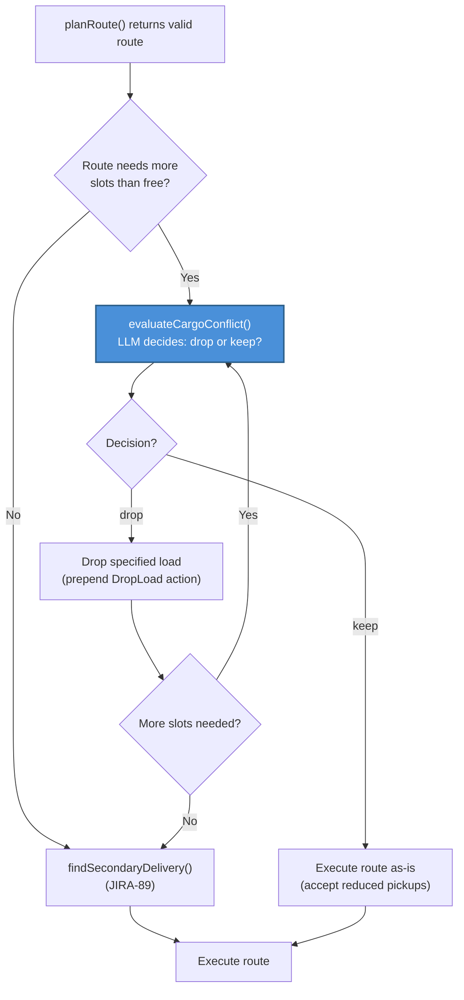

# JIRA-92: Cargo Conflict — Bot Won't Drop Low-Value Load to Enable Better Route

## Observed Behavior

Game `e36338a7`, Flash bot (Gemini Flash), turn 15:

Flash is carrying Hops (picked up at Cardiff, T8). Its best available play is a double-Sheep pickup at Glasgow delivering to Hamburg (27M) and Paris (19M) — 46M total with zero track cost over ~6 turns. But the train is a Freight (capacity 2). Hops occupies one slot, leaving only 1 free.

The LLM plans the double-Sheep route anyway (ignoring the capacity conflict). The A1 opportunistic scanner then grabs Hops at Cardiff en route to Glasgow, filling the second slot. Flash arrives at Glasgow, can only pick up 1 Sheep, and wastes a full turn on the second pickup.

Meanwhile, the Hops demand is Hops→Stockholm: 48M payout but ~40M track cost, 9+ turns, requires building across Scandinavia. Terrible ROI compared to double-Sheep.

## Expected Behavior

A human player would immediately recognize:
1. "I'm carrying Hops but the Stockholm delivery is awful — 40M track cost eats the profit"
2. "Double-Sheep is way better — 46M with zero track cost"
3. "I should drop Hops at the next city and pick up both Sheep"

The bot should make the same evaluation: compare the value of keeping carried cargo vs the value of the route it wants to execute, and drop low-value cargo when it blocks a superior plan.

## Root Cause

There is no decision point in the pipeline that evaluates "should I drop what I'm carrying to enable a better route?" The current architecture has:

- **`planRoute()`** — plans optimal routes but doesn't consider dropping existing cargo to unlock multi-pickup strategies. It sees `capacity 2, carrying Hops` but the prompt rule ("don't plan more pickups than capacity allows") doesn't instruct the LLM to subtract carried loads or suggest dropping them.

- **`findSecondaryDelivery()` (JIRA-89)** — fires after `planRoute()` to add secondary pickups. But it checks `unused cargo capacity` — if slots are full, it skips entirely. It never asks "should I drop something to CREATE capacity?"

- **`findDeadLoads()` (JIRA-89)** — detects loads with no matching demand card. Hops has a matching card (Hops→Stockholm), so it's not flagged as dead. It's just a *bad* demand, not a dead one.

- **`evaluateCargoForDrop()` (PlanExecutor)** — only fires reactively when a pickup action fails due to full capacity. By that point the bot has already traveled to the pickup city and wastes a turn on the drop.

- **Prompt rule 11** — "Drop useless loads" only covers loads with no matching demand card. Doesn't cover loads with a matching card that's economically terrible.

## Human Mental Model

This maps to JIRA-86 decision type 3/4 — the human has cargo and draws a new card (or re-evaluates after delivery). The human asks:

> "Is what I'm carrying worth keeping, given what I could be doing instead?"

This is a **comparative** judgment: value-of-keeping vs value-of-dropping-and-replanning. It requires knowing:
- What I'm carrying and how good/bad those deliveries are
- What route I want to execute and how many slots it needs
- Whether dropping frees enough slots to unlock the better plan

## Solution: LLM `evaluateCargoConflict()` call between `planRoute()` and execution

After `planRoute()` returns a valid route, before execution:

1. Count slots needed by the route's pickup stops (consecutive pickups from `currentStopIndex`)
2. Count free slots: `capacity - carried loads`
3. If `slotsNeeded > freeSlots`:
   - Identify carried loads NOT in the route's delivery plan
   - Call `evaluateCargoConflict()` — an LLM call (JIRA-86 Call C pattern) with full context

### LLM context for `evaluateCargoConflict()`

The LLM needs all the information a human player would consider:

```
CARGO CONFLICT: Your planned route needs more cargo slots than you have free.

PLANNED ROUTE:
  pickup(Sheep@Glasgow) → pickup(Sheep@Glasgow) → deliver(Sheep@Hamburg, 27M) → deliver(Sheep@Paris, 19M)
  Total payout: 46M | Estimated turns: 6 | Track cost: 0M

YOUR TRAIN: Freight (capacity 2, speed 9)
FREE SLOTS: 1 of 2

CARRIED LOADS (occupying slots):
  1. Hops → Stockholm: 48M payout, ~40M track cost to delivery, ~9 turns to deliver
     Track to Stockholm: NOT built. Delivery NOT on network.

YOUR DEMAND CARDS:
  [full demand ranking with feasibility annotations, same as planRoute context]

Should you DROP any carried loads to free slots for the planned route?
Consider:
- Is the carried load's delivery imminent (on network, 1-2 turns away)? If so, keep it.
- Is the carried load's delivery expensive/distant? Dropping may be better.
- Would dropping enable a significantly more profitable multi-pickup plan?
- An empty slot earning 23M/pickup over 6 turns beats a slot holding a 48M load that costs 40M track and 9 turns.
```

### Output schema

```typescript
interface CargoConflictEvaluation {
  action: "drop" | "keep";
  dropLoad?: string;       // which load to drop (if action is "drop")
  reasoning: string;
}
```

### Config

Lightweight — no thinking, temperature=0, low maxTokens (1024), short timeout (8s). This is a focused yes/no decision about a specific cargo conflict.

## Call Flow



## Implementation Plan

### Step 1: New method `LLMStrategyBrain.evaluateCargoConflict()`
- New system prompt `getCargoConflictPrompt()` in `prompts/systemPrompts.ts`
- New schema `CARGO_CONFLICT_SCHEMA` in `schemas.ts`
- Accepts: planned route, carried loads with delivery details, snapshot, context
- Returns: `CargoConflictEvaluation`
- Config: no thinking, temperature=0, maxTokens 1024, timeout 8s

### Step 2: Context enrichment
- For each carried load NOT in the route's delivery plan, include:
  - Delivery city, payout, estimated track cost, estimated turns
  - Whether delivery is on network (imminent) or requires building
  - The matching demand card's full feasibility annotation
- For the planned route, include:
  - Total payout, estimated turns, track cost
  - Number of pickup slots required

### Step 3: Wire into `AIStrategyEngine.takeTurn()`
- After `planRoute()` succeeds, before `PlanExecutor.execute()`
- Detect cargo conflict: `routePickupCount > freeSlots`
- Call `evaluateCargoConflict()`
- If `drop`: prepend `DropLoad` to plan, update simulation state, recheck slots
- If `keep`: proceed with route as-is (bot will pick up fewer loads than planned)

### Step 4: Wire into TurnComposer reserved slots
- Update `splitMoveForOpportunities` to count all consecutive upcoming pickup stops
  when computing `reservedSlots` (currently only reserves 1)
- Prevents A1 opportunistic scanner from grabbing loads that would block planned pickups

## Relationship to Other JIRAs

- **JIRA-86**: `evaluateCargoConflict()` is an instance of Call C (`evaluateOpportunity()`) — same architectural pattern, focused on the cargo drop decision
- **JIRA-87**: En-route pickup scanning — provides context about what's available nearby
- **JIRA-89**: `findSecondaryDelivery()` — runs after cargo conflict resolution to find add-on pickups
- **JIRA-91**: Fresh post-delivery context — ensures cargo state is accurate when evaluating

## Edge Cases

- **All carried loads are in the route's delivery plan**: No conflict — every load is accounted for, skip the call
- **Multiple loads to drop**: Loop — call `evaluateCargoConflict()` for each conflicting load until enough slots are free or LLM says "keep"
- **Heavy/Superfreight with 1 bad load and 2 good**: LLM evaluates each independently, only drops the bad one
- **Carried load is deliverable on existing network in 1-2 turns**: LLM should say "keep" — imminent delivery is more valuable than dropping
- **LLM says "keep" but route can't execute fully**: Bot picks up fewer loads than planned, which is the correct conservative choice when the LLM judges the carried load as valuable

## Files to Modify

- `src/server/services/ai/LLMStrategyBrain.ts` — new `evaluateCargoConflict()` method
- `src/server/services/ai/AIStrategyEngine.ts` — cargo conflict detection and drop logic after `planRoute()`
- `src/server/services/ai/prompts/systemPrompts.ts` — new `getCargoConflictPrompt()`
- `src/server/services/ai/schemas.ts` — new `CARGO_CONFLICT_SCHEMA`
- `src/server/services/ai/TurnComposer.ts` — fix `reservedSlots` to count consecutive upcoming pickups

## Success Metrics

- Bot drops low-value cargo when a better multi-pickup route is available
- Bot keeps high-value cargo when delivery is imminent (LLM correctly says "keep")
- Reduced single-load Freight trips when double-pickup was possible
- Higher payoff-per-turn ratio in games with cargo conflicts
- Flash game `e36338a7` scenario: bot drops Hops, picks up 2 Sheep, delivers 46M in ~6 turns instead of carrying Hops for 9+ turns
