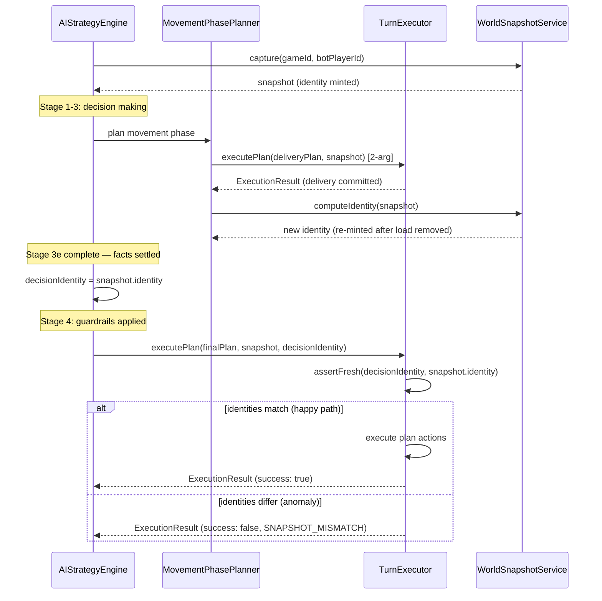

# Turn-Snapshot Freshness Contract (JIRA-278)

How the AI bot detects and rejects stale turn plans before they mutate game state.

---

## Overview

### The Problem

The AI decision pipeline reads a `WorldSnapshot`, runs LLM strategy, and then executes the resulting plan against the database. Between snapshot capture and execution, facts can change:

- A delivery action inside Stage 3 (MovementPhasePlanner auto-delivery) removes a load from `bot.loads` and re-mints `snapshot.identity`.
- An event-card-triggered card draw changes `bot.demandCards`.

Before JIRA-278, **only the post-delivery replan path** (`PostDeliveryReplanner`) guarded against stale facts. The final `TurnExecutor.executePlan` call had no freshness check. If facts drifted between decision time and execution time, the executor would apply the plan silently against wrong state.

### The Solution

JIRA-278 extends the freshness contract to the **main execution boundary**:

1. `AIStrategyEngine.computeTurn` captures `decisionIdentity = snapshot.identity` after all Stage 3 mid-decision mutations have settled.
2. That identity is passed as the optional third argument to the final `TurnExecutor.executePlan` call.
3. `TurnExecutor.executePlan` runs `assertFresh` as its **first statement** — before any state mutation — and returns a fail-closed `ExecutionResult` on mismatch.

---

## Technical Changes

### 1. Relocation of Freshness Primitives (BE-001)

`assertFresh` and `SnapshotMismatch` were moved from `PostDeliveryReplanner.ts` to `WorldSnapshotService.ts`, placed alongside `computeIdentity`.

**Before:**
```
src/server/services/ai/PostDeliveryReplanner.ts  ← owned assertFresh + SnapshotMismatch
```

**After:**
```
src/server/services/ai/WorldSnapshotService.ts   ← owns assertFresh + SnapshotMismatch
src/server/services/ai/PostDeliveryReplanner.ts  ← re-exports for backward compatibility
```

`PostDeliveryReplanner.ts` re-exports both symbols so all existing callers continue to work without change:

```typescript
import { assertFresh, SnapshotMismatch } from './WorldSnapshotService';
export { assertFresh, SnapshotMismatch };
```

### 2. Freshness Gate in TurnExecutor (BE-002)

`TurnExecutor.executePlan` gains an optional third parameter:

```typescript
static async executePlan(
  plan: TurnPlan,
  snapshot: WorldSnapshot,
  derivedFromIdentity?: SnapshotIdentity,
): Promise<ExecutionResult>
```

The gate is the **first statement** in the method — before the MultiAction dispatch and before the `preExecuted` short-circuit:

```typescript
const freshnessResult = assertFresh(derivedFromIdentity, snapshot.identity);
if (freshnessResult.isErr()) {
  const reason = freshnessResult.error.reason;
  const rejectedAction =
    plan.type === 'MultiAction'
      ? ((plan.steps[0]?.type as AIActionType) ?? AIActionType.PassTurn)
      : (plan.type as AIActionType);
  console.warn(
    `[TurnExecutor] Plan rejected — snapshot mismatch: ` +
    `derived=${derivedFromIdentity?.turnNumber}:${derivedFromIdentity?.factsHash} ` +
    `live=${snapshot.identity?.turnNumber}:${snapshot.identity?.factsHash}`,
  );
  return {
    success: false,
    action: rejectedAction,
    cost: 0,
    segmentsBuilt: 0,
    remainingMoney: snapshot.bot.money,
    durationMs: 0,
    error: reason,
    rejectionReason: { code: 'SNAPSHOT_MISMATCH', message: reason },
  };
}
```

The gate is positioned at entry because `executeMultiAction` re-mints `snapshot.identity` after every step — a per-step check would false-positive on normal multi-delivery turns.

### 3. Identity Threading in AIStrategyEngine (BE-003)

`AIStrategyEngine.computeTurn` captures `decisionIdentity` after Stage 3e completes and immediately before Stage 4 guardrails:

```typescript
// After Stage 3e: all mid-decision executions have settled and re-minted identity.
// Any mutation between here and Stage 5 will trigger SNAPSHOT_MISMATCH.
const decisionIdentity = snapshot.identity;

// ── Stage 4: Apply guardrails ──
// ...

// ── Stage 5: Execute the plan ──
const result = await TurnExecutor.executePlan(finalPlan, snapshot, decisionIdentity);
```

**Why after Stage 3e, not earlier?** Stage 3 sub-components (MovementPhasePlanner auto-delivery, NewRoutePlanner early delivery) call `TurnExecutor.executePlan` mid-decision and legitimately re-mint `snapshot.identity`. Capturing before Stage 3e would produce a stale `decisionIdentity` that no longer matches the live `snapshot.identity` at Stage 5, causing false positives on every delivery turn.

---

## Mid-Decision Calls Are Intentionally 2-Arg

Three call sites execute actions mid-decision and **must remain 2-arg** (no `derivedFromIdentity`) so the gate is a no-op for them:

| File | Line | Purpose |
|------|------|---------|
| `NewRoutePlanner.ts` | 135 | Early delivery before new route planning |
| `MovementPhasePlanner.ts` | 259 | Early pickup during movement phase |
| `MovementPhasePlanner.ts` | 335 | Early delivery during movement phase |

These calls legitimately mutate game state and re-mint `snapshot.identity`. Passing `derivedFromIdentity` to them would cause every mid-decision delivery to trigger SNAPSHOT_MISMATCH.

---

## Architecture Decisions (ADRs)

### ADR-1: Single gate at `executePlan` entry

The check runs once, as the first statement in `executePlan`, before any dispatch. Alternatives considered:

- **Per-step check inside `executeMultiAction`**: Rejected. `executeMultiAction` re-mints identity after each step, so any step after the first would fail.
- **Gate at the `AIStrategyEngine` level before Stage 5**: Rejected. Would duplicate logic and not protect calls from other callers of `executePlan`.

### ADR-2: Move primitives to `WorldSnapshotService`

`assertFresh` compares two `SnapshotIdentity` values — pure logic with no side effects. `WorldSnapshotService` owns `computeIdentity` (the identity mint) and is the natural home. `PostDeliveryReplanner` was a temporal accident of where it was first implemented.

No import cycles are introduced: `WorldSnapshotService` → `GuardrailEnforcer` → `routeHelpers` — no path back.

### ADR-3: Fail-closed `ExecutionResult` (not throw)

On mismatch, `executePlan` returns `{ success: false, rejectionReason: { code: 'SNAPSHOT_MISMATCH' } }` rather than throwing. This matches the existing `ActionRestrictionError` convention and allows callers to log and recover without try/catch.

### ADR-4: Capture after Stage 3e, not at snapshot time

Capturing immediately after `capture()` would false-positive on every turn with a mid-decision delivery, because Stage 3 re-mints identity. The correct anchor point is after all legitimate mid-decision mutations have settled.

### ADR-5: Parameter is optional

Making `derivedFromIdentity` optional (`?`) preserves full backward compatibility. All existing callers — including the three mid-decision call sites — continue to work without change. Only the final Stage 5 call in `AIStrategyEngine` passes the identity.

---

## Backward Compatibility

- **Legacy snapshots** (no `identity` field): `assertFresh` returns `Ok` when either identity is `undefined`. No check is performed. Existing behavior is preserved exactly.
- **Existing `executePlan` callers**: The parameter is optional. All 2-arg calls bypass the gate entirely.
- **`PostDeliveryReplanner` consumers**: `assertFresh` and `SnapshotMismatch` are re-exported unchanged. No import path changes needed.
- **`ExecutionResult` type**: `rejectionReason.code` is widened from `ActionRestrictionErrorCode` to `ActionRestrictionErrorCode | 'SNAPSHOT_MISMATCH'`. Existing code checking `code !== 'SNAPSHOT_MISMATCH'` is unaffected.

---

## Sequence Diagram



---

## Error Handling and Observability

### `SnapshotMismatch` error class

Defined in `WorldSnapshotService.ts`. Extends `Error` with a typed `reason` string sourced from `GuardrailEnforcer.SNAPSHOT_MISMATCH`:

```typescript
export class SnapshotMismatch extends Error {
  readonly reason: string;
  constructor(reason: string) {
    super(reason);
    this.name = 'SnapshotMismatch';
    this.reason = reason;
  }
}
```

The `reason` string is a product-language sentence (not an error code), suitable for postmortem logs.

### Rejection result shape

When the gate fires, `executePlan` returns:

```typescript
{
  success: false,
  action: <rejectedAction>,   // first step type for MultiAction, plan.type for single
  cost: 0,
  segmentsBuilt: 0,
  remainingMoney: snapshot.bot.money,
  durationMs: 0,
  error: GuardrailEnforcer.SNAPSHOT_MISMATCH,
  rejectionReason: {
    code: 'SNAPSHOT_MISMATCH',
    message: GuardrailEnforcer.SNAPSHOT_MISMATCH,
  },
}
```

No game state is mutated when this result is returned.

### Log format

```
[TurnExecutor] Plan rejected — snapshot mismatch: derived=<turnNumber>:<factsHash> live=<turnNumber>:<factsHash>
```

Both identity hashes are logged so postmortem analysis can identify which fact changed between decision and execution.

---

## Testing Strategy

### Unit tests

| File | Tests | Coverage |
|------|-------|----------|
| `src/server/__tests__/TurnExecutor.freshnessGate.test.ts` | 11 | Stale/fresh/legacy paths, MultiAction rejection at entry, rejectedAction derivation |
| `src/server/__tests__/ai/TurnExecutor.executePlanFreshness.test.ts` | 22 | Full canonical suite: rejection shape, console.warn content, all legacy paths |
| `src/server/__tests__/ai/assertFresh.test.ts` | 16 | `assertFresh` unit tests + re-export verification from `PostDeliveryReplanner` |

### Integration tests

| File | Section | Tests | Coverage |
|------|---------|-------|----------|
| `src/server/__tests__/ai/snapshotContract.integration.test.ts` | Section 6 | 3 | BE-003 capture-point false-positive regression |
| `src/server/__tests__/ai/snapshotContract.integration.test.ts` | Section 7 | 4 | TurnExecutor freshness gate with real `computeIdentity` hashes |

### Key test scenarios

**Stale loads trigger rejection:**
```typescript
snapshot.identity = computeIdentity(snapshot);          // hash-A
const decisionIdentity = snapshot.identity;
snapshot.bot.loads = [];                                 // delivery happened
snapshot.identity = computeIdentity(snapshot);          // hash-B ≠ hash-A
const result = await TurnExecutor.executePlan(plan, snapshot, decisionIdentity);
// result.rejectionReason.code === 'SNAPSHOT_MISMATCH'
```

**Mid-decision delivery does NOT false-positive:**
```typescript
// After Stage 3e re-mint: decisionIdentity === snapshot.identity
const decisionIdentity = snapshot.identity;             // captured post-remint
const result = await TurnExecutor.executePlan(plan, snapshot, decisionIdentity);
// result.success === true (gate passes)
```

**Legacy snapshot bypasses gate:**
```typescript
delete snapshot.identity;                               // legacy — no identity
const result = await TurnExecutor.executePlan(plan, snapshot);
// gate is no-op: result.success === true
```
